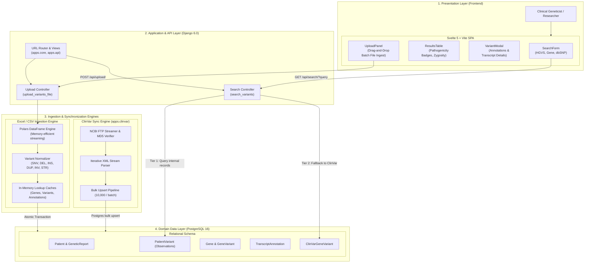
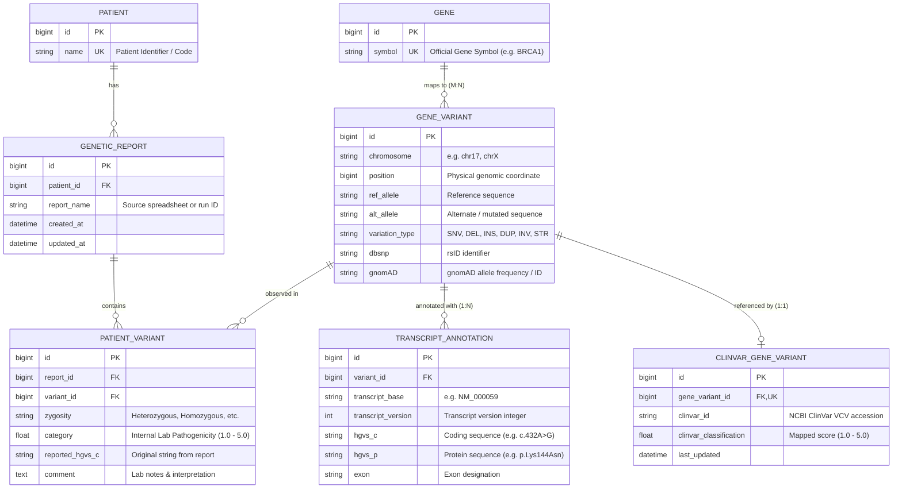

# Caliber

**Caliber** is a full-stack genomic variant curation, exploration, and pathogenicity classification platform. It empowers geneticists and clinical researchers to search, evaluate, and classify genetic variants against internal patient records and global reference repositories (NCBI ClinVar).

---

## Table of Contents

- [Application Architecture](#application-architecture)
  - [System Flow & Component Overview](#system-flow--component-overview)
  - [Architectural Layers](#architectural-layers)
  - [Domain Model & Entity Relationships](#domain-model--entity-relationships)
- [Data Processing & Ingestion Pipelines](#data-processing--ingestion-pipelines)
  - [1. Clinical Excel / CSV Ingestion Engine](#1-clinical-excel--csv-ingestion-engine)
  - [2. ClinVar Bulk Synchronization Pipeline](#2-clinvar-bulk-synchronization-pipeline)
  - [3. Two-Tier Search Resolution Engine](#3-two-tier-search-resolution-engine)
- [Pathogenicity Classification Scheme](#pathogenicity-classification-scheme)
- [Project Directory Structure](#project-directory-structure)
- [Local Development Setup](#local-development-setup)
- [Production Deployment (Docker)](#production-deployment-docker)
  - [Deployment Steps](#deployment-steps)
  - [Managing Containers & Database](#managing-containers--database)
- [License & Contributing](#license--contributing)

---

## Application Architecture

### System Flow & Component Overview

The application is structured into four core functional layers: a reactive Single-Page Application (SPA) frontend, a high-throughput Django REST backend, an asynchronous data ingestion & sync engine, and a relational PostgreSQL database.



---

### Architectural Layers

#### 1. Presentation Layer (`frontend/`)
- **Technology**: **Svelte 5**, **TypeScript**, and **Vite** with **Tailwind/Custom CSS**.
- **Key Modules**:
  - `SearchForm.svelte`: Provides real-time query inputs filtering by HGVS notation (e.g., `c.432A>G`), Gene symbol (e.g., `BRCA1`), or dbSNP ID (e.g., `rs123456`).
  - `ResultsTable.svelte`: Clinical data grid rendering zygosity, variant types, genomic coordinates, and color-coded ACMG pathogenicity badges.
  - `VariantModal.svelte`: Modal displaying detailed transcript-level annotations, exon numbers, protein alterations (`hgvs_p`), and clinical comments.
  - `UploadPanel.svelte`: Client-side drag-and-drop file uploader with validation for `.xlsx`, `.xls`, and `.csv` files.
- **Production Delivery**: In production, Vite compiles the Svelte SPA into optimized static artifacts (`main.js` and `main.css`). These are served directly through Django and **WhiteNoise** with gzip/brotli compression and persistent HTTP caching headers.

#### 2. API & Controller Layer (`apps/api/`, `apps/core/`)
- **Technology**: **Django 6.0** (Python 3.12).
- **Core Endpoints**:
  - `GET /api/search/`: Executes the two-tier variant discovery query with pagination metadata.
  - `POST /api/upload/`: Receives uploaded spreadsheets, writes to transient storage, triggers streaming DataFrame parsing, and returns ingested row counts.
  - `GET /`: Serves the bootstrapping HTML container (`core/index.html`) that mounts the Svelte SPA.

#### 3. Ingestion & Pipeline Layer (`apps/core/management/`, `apps/clinvar/`)
- **High-Performance Ingestion**: Uses **Polars** to achieve sub-second spreadsheet parsing without loading entire datasets into Python object memory.
- **Deduplication Caches**: Employs dedicated in-memory dictionary and set caches during data imports to eliminate repetitive database lookups.
- **ClinVar Synchronization**: Streams multi-gigabyte NCBI ClinVar release XML files row-by-row, resolving genes and upserting variants in 10,000-item database batches.

#### 4. Persistence Layer (`apps/core/models.py`, `apps/clinvar/models.py`)
- **Technology**: **PostgreSQL 16**.
- **Integrity**: Enforces genomic coordinate uniqueness at the database level and uses composite indexes across frequently queried identifiers (`dbsnp`, `hgvs_c`, `chromosome + position`).

---

### Domain Model & Entity Relationships

The data model cleanly decouples **biological variant definitions** from **patient-specific clinical observations** and **external reference databases**:



#### Key Relational Design Principles:
1. **Physical Coordinate Identity**: `GeneVariant` records are uniquely keyed by `(chromosome, position, variation_type, ref_allele, alt_allele)`. This prevents duplicate entries regardless of how many patients carry the mutation.
2. **Decoupled Transcript Annotations**: A single genomic variant can map to multiple transcripts (`TranscriptAnnotation`), preserving splice variant annotations independently of patient data.
3. **Observation Decoupling**: Clinical data (such as zygosity, laboratory comments, and sample-specific classification) lives in `PatientVariant`, keeping the underlying variant catalog clean and reusable.

---

## Data Processing & Ingestion Pipelines

### 1. Clinical Excel / CSV Ingestion Engine

When laboratory results are ingested (via `init_db` or the `/api/upload/` UI endpoint):

```
Uploaded Spreadsheet (.xlsx / .csv)
               │
               ▼
   [Polars Sheet & Type Detection]
   (Inspects 'default', 'Filtr JI', or active sheet)
               │
               ▼
      [Row Normalization]
   - Variation type mapped to standard enum (SNV, DEL, INS, DUP, INV, STR)
   - HGVS parsing splits transcript base and version (e.g. NM_000059.3 -> base + version)
               │
               ▼
   [In-Memory Cache Interception]
   - Checks local cache for Patient, Gene, Variant, Annotation
   - Avoids individual SQL SELECT statements inside loops
               │
               ▼
   [Atomic Transaction Persistence]
   - Upserts GeneVariant and links Gene (M2M)
   - Creates TranscriptAnnotation
   - Creates GeneticReport linked to Patient
   - Saves PatientVariant observation
```

### 2. ClinVar Bulk Synchronization Pipeline

The ClinVar engine (`python manage.py sync_clinvar`) synchronizes local data against the monthly NCBI ClinVar release:

1. **Integrity-Checked Download**: Fetches `ClinVarVCVRelease_00-latest.xml.gz` from NCBI's FTP server and validates its MD5 checksum against the remote manifest before processing.
2. **Memory-Safe Streaming**: Employs an iterative XML parser (`parse_clinvar_xml`) that yields individual variant elements without loading the ~30GB+ uncompressed XML dataset into RAM.
3. **Bulk Upsert Pipeline**: Uses `ClinVarBulkImporter` with 10,000-item buffers:
   - **Stage 1**: Resolves and bulk-creates missing `Gene` entities.
   - **Stage 2**: Bulk-upserts `GeneVariant` records via PostgreSQL's `ON CONFLICT (chromosome, position, variation_type, ref_allele, alt_allele) DO UPDATE`.
   - **Stage 3**: Bulk-inserts transcript annotations and ClinVar classifications.

### 3. Two-Tier Search Resolution Engine

When a user searches by variant notation, gene, or dbSNP ID:

```
                    User Query (e.g. "BRCA1" or "rs80357906")
                                       │
                                       ▼
                   ┌───────────────────────────────────────┐
                   │  Tier 1: Internal Patient Registry    │
                   │  Searches PatientVariant records      │
                   └──────────────────┬────────────────────┘
                                      │
                         Found? ──────┴────── Not Found?
                           │                      │
                           ▼                      ▼
                 [Return Patient Data] ┌──────────────────────────────┐
                 - Patient Name        │ Tier 2: ClinVar Fallback     │
                 - Lab Classification  │ Searches ClinVarGeneVariant  │
                 - Zygosity & Comments └──────────────┬───────────────┘
                                                      │
                                                      ▼
                                            [Return Reference Data]
                                            - ClinVar Classification
                                            - Global Clinical Evidence
```

---

## Pathogenicity Classification Scheme

Caliber unifies disparate classification strings from internal clinical spreadsheets and external ClinVar records into a standardized 5-tier scoring model based on ACMG (American College of Medical Genetics) guidelines:

| Tier | Classification Enum | Score | Clinical Meaning |
|:----:|:-------------------|:-----:|:-----------------|
| **5** | `PATHOGENIC` | `5.0` | Disease-causing variant |
| **4** | `LIKELY_PATHOGENIC` | `4.0` | High probability (>90%) of being disease-causing |
| **3** | `UNCERTAIN_SIGNIFICANCE` | `3.0` | VUS: Insufficient or conflicting evidence |
| **2** | `LIKELY_BENIGN` | `2.0` | High probability (>90%) of not causing disease |
| **1** | `BENIGN` | `1.0` | Harmless genetic variation |

Compound strings (such as `Pathogenic/Likely pathogenic` or `Likely benign/Uncertain significance`) are parsed and assigned intermediate numerical scores (`4.5`, `2.5`).

---

## Project Directory Structure

```
Caliber/
├── apps/
│   ├── api/                     # REST API endpoints & search controllers
│   │   ├── models.py            # API-specific models
│   │   ├── views.py             # search_variants and upload_variants_file
│   │   └── urls.py              # API routing (/api/search, /api/upload)
│   ├── clinvar/                 # ClinVar integration pipeline
│   │   ├── models.py            # ClinVarGeneVariant reference model
│   │   ├── services/
│   │   │   ├── downloader.py    # NCBI FTP streaming & MD5 verification
│   │   │   ├── importer.py      # Batch upsert engine (10k buffer)
│   │   │   ├── parser.py        # Streaming XML element parser
│   │   │   └── transformer.py   # Coordinate & classification cleaning
│   │   └── management/commands/
│   │       └── sync_clinvar.py  # 'sync_clinvar' management command
│   └── core/                    # Core genomic domain models & logic
│       ├── models.py            # Gene, GeneVariant, Patient, PatientVariant
│       ├── enums.py             # ClassificationEnum & score mapping
│       ├── views.py             # SPA HTML template bootstrap
│       └── management/commands/
│           └── init_db.py       # Excel spreadsheet batch ingestion
├── caliber/                     # Django project configuration
│   ├── settings.py              # Production-tuned settings (WhiteNoise, DB)
│   ├── urls.py                  # Root URL configuration
│   └── wsgi.py                  # WSGI entrypoint for Gunicorn
├── frontend/                    # Svelte 5 + Vite Single Page Application
│   ├── src/
│   │   ├── components/          # SearchForm, ResultsTable, VariantModal, etc.
│   │   ├── types/               # TypeScript interfaces for variants & API
│   │   ├── App.svelte           # Root application view
│   │   └── main.ts              # Svelte client bootstrapper
│   ├── package.json             # Frontend dependencies (pnpm)
│   └── vite.config.ts           # Vite build config targeting Django static dir
├── data/                        # Reference datasets, ClinVar dumps, and Excel files
├── templates/core/index.html    # Base HTML template loading compiled Svelte SPA
├── Dockerfile                   # Multi-stage container build (Node 22 + Python 3.12)
├── docker-compose.yml           # Multi-service stack (db, web, optional caddy)
├── docker-entrypoint.sh         # Startup script (DB readiness + migrations)
├── Caddyfile                    # Automatic HTTPS reverse proxy configuration
├── pyproject.toml               # Python project configuration & dependencies
└── README.md                    # Project documentation
```

---

## Local Development Setup

To run Caliber locally without Docker:

```bash
# 1. Install Python dependencies
uv sync # or pip install -r pyproject.toml

# 2. Start the Svelte frontend dev server (with Hot Module Replacement)
cd frontend
pnpm install
pnpm run dev   # Starts Vite server on http://localhost:5173

# 3. In a separate terminal, apply migrations and run Django dev server
python manage.py migrate
python manage.py runserver 0.0.0.0:8000
```
Visit `http://localhost:8000` to interact with the application.

---

## Production Deployment (Docker)

Caliber is fully containerized using a multi-stage Dockerfile (Node 22 for frontend compilation and Python 3.12 for Django/Gunicorn) paired with PostgreSQL 16.

### Deployment Steps

1. **Clone repository onto your server**:
   ```bash
   git clone <your-repo-url> /opt/caliber
   cd /opt/caliber
   ```

2. **Configure production environment**:
   ```bash
   cp .env.example .env
   nano .env  # Configure SECRET_KEY, ALLOWED_HOSTS, POSTGRES_PASSWORD, etc.
   ```

3. **Start the containers with Docker Compose**:
   ```bash
   docker compose up -d --build
   ```

4. **Create the administrative superuser**:
   ```bash
   docker compose exec web python manage.py createsuperuser
   ```

### Managing Containers & Database

- **View live application logs**:
  ```bash
  docker compose logs -f web
  ```
- **Run initial spreadsheet ingestion inside container**:
  ```bash
  docker compose exec web python manage.py init_db --root_dir /app/data
  ```
- **Trigger ClinVar monthly synchronization**:
  ```bash
  docker compose exec web python manage.py sync_clinvar
  ```
- **Backup PostgreSQL database**:
  ```bash
  docker compose exec -T db pg_dump -U caliber_user caliber_db | gzip > backup_$(date +%Y%m%d).sql.gz
  ```
- **Restore PostgreSQL database**:
  ```bash
  gunzip -c backup_YYYYMMDD.sql.gz | docker compose exec -T db psql -U caliber_user caliber_db
  ```
